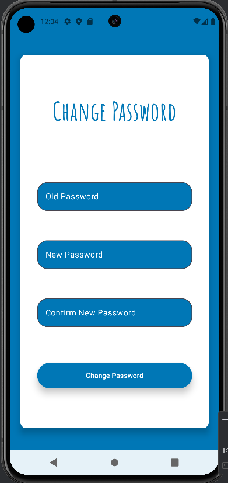
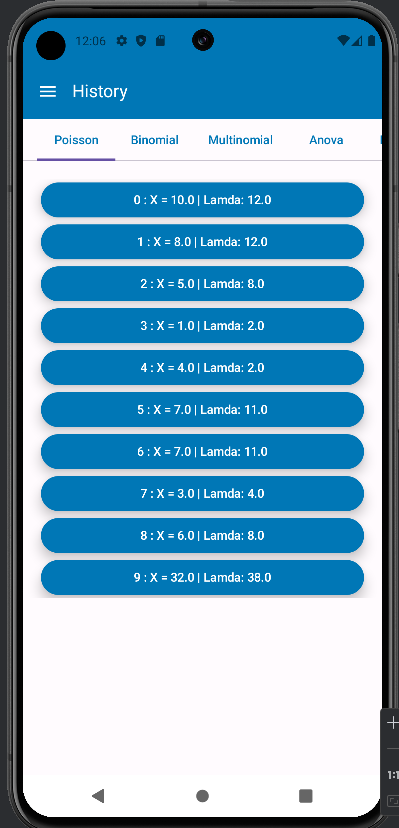
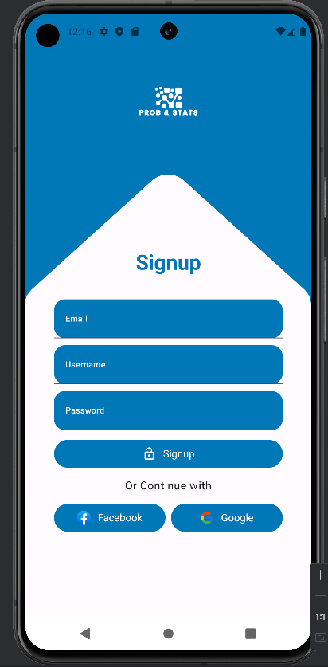
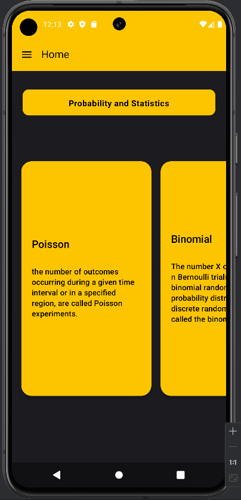
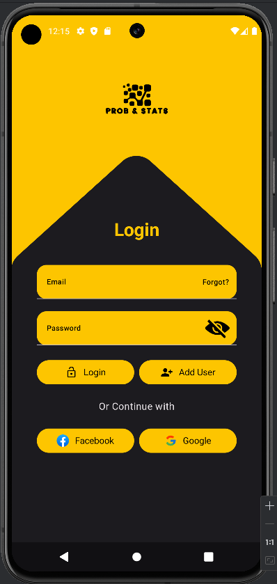
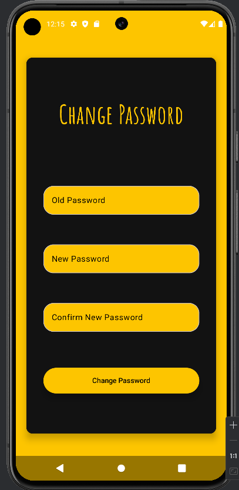
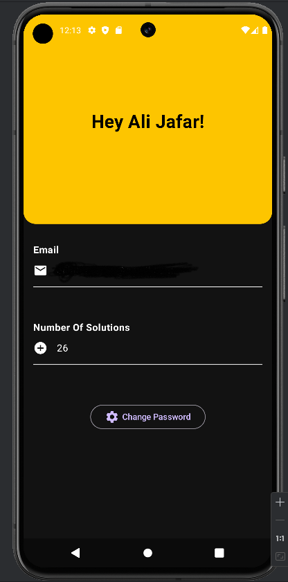
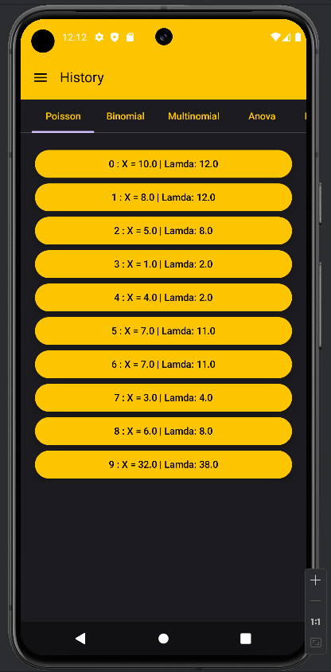
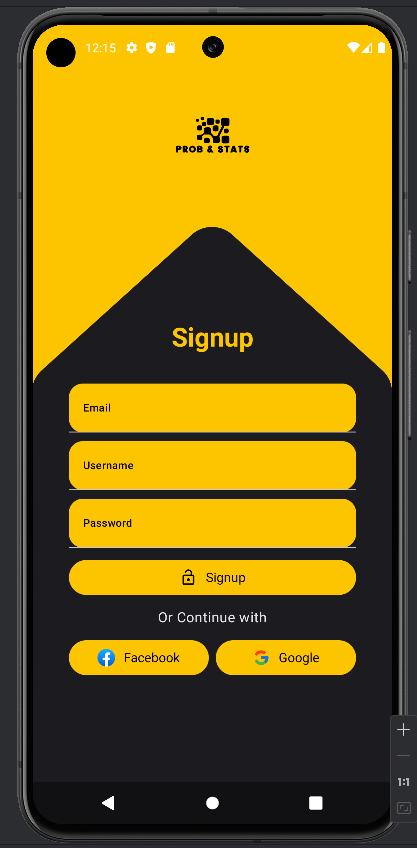

<h1 align="center">
 
  
 
 
Probability and Statistics with Jetpack Compose
</h1>

## Download

Go to the [releases page](https://github.com/mrcsxsiq/Kotlin-Pokedex/releases) to download the latest available apk.

<!--
Also available in Play Store

-->

## Screenshots

  
  
  
  
  
  

  
  
  
  
  
  

## Development Roadmap

- [x] [Kotlin](https://kotlinlang.org/)
- [x] [LiveData](https://developer.android.com/topic/libraries/architecture/livedata)
- [x] [Navigation](https://developer.android.com/topic/libraries/architecture/navigation)
- [x] [ViewModel](https://developer.android.com/topic/libraries/architecture/viewmodel)
- [x] [Coroutines](https://developer.android.com/topic/libraries/architecture/coroutines)
- [x] [Retrofit](https://square.github.io/retrofit/)
- [x] [Jetpack Compose](https://developer.android.com/jetpack/compose)
- [x] [Firebase](https://firebase.google.com/)

## Features

- [x] Login Page
- [x] Anova
- [x] Bayes Rule
- [x] Binomial
- [x] Grouped
- [x] hypothesis
- [x] Multinomial
- [x] Poisson
- [x] Simple Linear Regression
- [x] Ungrouped

